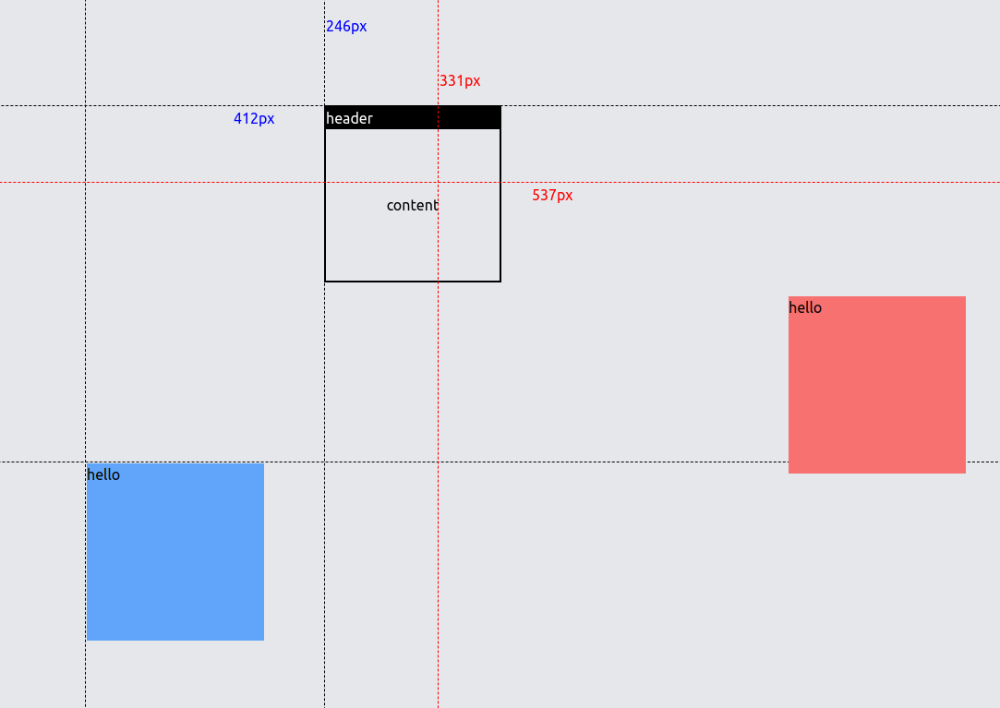

### vue3-v-drag

这是一个自定义指令, 它允许你拖拽指定元素



### How to use ?

#### **引入到你的项目**

```ts
// main.ts

import { createApp } from "vue";
import App from "./App.vue";
import vDrag from "vue3-v-drag"

const app = createApp(App);
app.use(vDrag)

app.mount("#app");
```


#### 基本使用

在元素上添加`v-drag` 即可

```vue
...
<div v-drag>
drag me!
</div>
...
```


#### 支持的修饰符

- `indicator` : 这将开启指示器, 它会显示元素和鼠标的坐标信息

  ```vue
  <Dialog v-drag.indicator />
  ```

- `keep`: `keep` 修饰符仅在 `indicator` 开启时生效, 它决定了鼠标松开时,是否保留 鼠标的坐标信息.

  ```vue
  <Dialog v-drag.indicator.keep/>
  ```

  


#### 支持的回调

你可以通过传值的方式传入一个含有 `mouseup`, `mounsedown` 回调handler 的对象, 以实现一些功能.

```vue
<!--template-->
<Dialog v-drag.indicator.keep="{ mouseup: mouseUpHandler, mousedown: mouseDownHandler }" v-model="show" />
```

```ts
//script 
const mouseUpHandler = () => {
  console.log("mouseUp trigger");
};
const mouseDownHandler = () => {
  console.log("mouseDown trigger");
};
```

