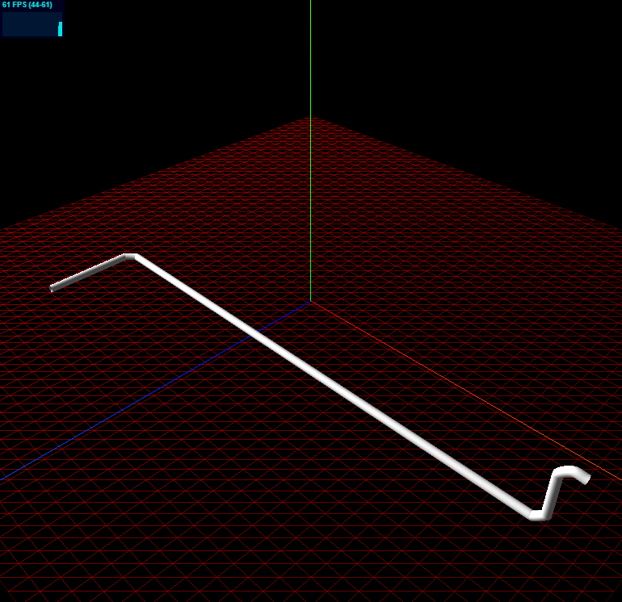

# 这是一个最基础的Three.JS 3D场景制作的模版

对于Three.js初学者，可能看到网上一堆各种文章，看着很杂乱。
该模版仅包含了一个OrbitCtrols轨道控制器，以及Three.js，加上一个性能插件。用于学习各种demo实验测试用。

*仅html + js*

## initialization.js

程序入口，初始化的触发，还有一个控制器，控制器暂时不宜放在papare.js中去初始化，变量参数会比较麻烦。

## papare.js

把渲染器，相机，场景等必要的基础组件单独初始化。 如需修改相关属性，仅需在此修改。

## draw.js

物体的绘制，只需要在draw中去进行创作。 

